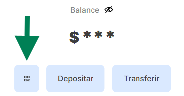
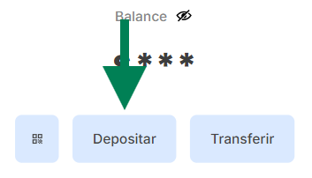
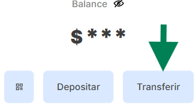

# Frontend

```
-- Login / Register
                    -- Dashboard -
                                 - Leer QR
                                 - Depositar    ->  Generar QR
                                                ->  Generar enlace
                                                ->  Datos de Cuenta
                                                ->  Deposito con Mercado pago - Pronto
                                 - Transferencia
                                                -> Solo ingresamos dos elementos
                                                    -> Monto
                                                    -> Wallet o Alias
```

## Leer QR



> [!NOTE]
> Esta opción nos permite leer códigos QR con la cámara que se generan a través de `Depositar -> Generar QR`

## Depositar



> [!NOTE]
> Aquí podemos generar códigos QR y enlaces de pago, así como también ver los datos de la cuenta con su respectivo alias y wallet

### Transferir



> [!NOTE]
> Dentro de la opción transferir, podemos realizar transferencias a otras cuentas con solo dos elementos: el alias o wallet y el monto.
